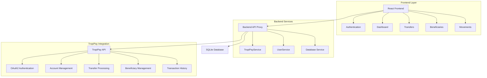

# TropiPay Wallet Demo - Client Integration Guide

**A complete reference implementation for TropiPay API integration**

This demo wallet provides TropiPay clients with a comprehensive example of how to integrate TropiPay's API services to build their own digital wallet applications. The implementation demonstrates best practices, security patterns, and UI/UX design for financial applications.

---

## 🎯 **For TropiPay Integration Partners**

This repository serves as your **complete integration guide** and **reference implementation** for building wallet applications on top of TropiPay's infrastructure. Every component demonstrates real-world usage patterns you can adapt for your own projects.

### **What You'll Learn**
- ✅ **Complete OAuth2 authentication flow** with Client Credentials
- ✅ **Multi-environment setup** (Development/Production)
- ✅ **Account management** with real-time balance updates
- ✅ **International money transfers** with fee simulation
- ✅ **Two-factor authentication** (SMS + Google Authenticator)
- ✅ **Beneficiary management** with IBAN/SWIFT validation
- ✅ **Transaction history** with advanced filtering
- ✅ **Multi-currency support** (USD, EUR, CUP)
- ✅ **Security best practices** for financial applications
- ✅ **Responsive UI/UX** patterns for web and mobile

---

## 🏗️ **Architecture Overview**



### **Technology Stack**

**Frontend (React)**
- **React 18** + Context API for state management
- **TailwindCSS** for responsive design
- **Axios** for API communication
- **Lucide React** for icons
- **React Hot Toast** for notifications

**Backend (Node.js)**
- **Express.js** API server
- **SQLite3** for local data caching
- **Axios** for TropiPay API integration
- **CORS** configured for React frontend

**TropiPay Integration**
- **OAuth2 Client Credentials** flow
- **RESTful API** consumption
- **Multi-environment** support (dev/prod)
- **Real-time data** synchronization

---

## 🚀 **Quick Start for Integration Partners**

### **Prerequisites**
- Node.js 16+ installed
- TropiPay Developer Account
- **Client ID** and **Client Secret** from TropiPay

### **1. Get Your TropiPay Credentials**
1. Register at [TropiPay Developer Portal](https://developer.tropipay.com)
2. Create a new application
3. Copy your **Client ID** and **Client Secret**
4. Configure redirect URLs if needed

### **2. Clone and Setup**
```bash
# Clone the repository
git clone <repository-url>
cd tropipay-wallet

# Install frontend dependencies
npm install

# Install backend dependencies
cd backend
npm install
```

### **3. Environment Configuration**
Create a `.env` file in the `backend/` directory:
```bash
# TropiPay Environment Configuration
TROPIPAY_DEFAULT_ENV=development
TROPIPAY_DEV_API_URL=https://sandbox.tropipay.me/api/v3
TROPIPAY_PROD_API_URL=https://www.tropipay.com/api/v3

# Server Configuration
PORT=3001
FRONTEND_URL=http://localhost:3000

# API Configuration
API_TIMEOUT=10000
ENABLE_API_LOGGING=true

# Database Configuration
DB_PATH=./tropipay_wallet.db
```

### **4. Run the Application**

**Terminal 1 - Start Backend:**
```bash
cd backend
npm start
# Backend will run on http://localhost:3001
```

**Terminal 2 - Start Frontend:**
```bash
npm start
# Frontend will open on http://localhost:3000
```

### **5. Login with Your Credentials**
1. Open http://localhost:3000
2. Enter your TropiPay **Client ID** and **Client Secret**
3. Select environment (Development recommended for testing)
4. Click "Iniciar Sesión"

---

## 📡 **TropiPay API Integration Guide**

### **Authentication Flow**

The wallet implements OAuth2 Client Credentials flow:

```javascript
// Step 1: Get Access Token
POST https://sandbox.tropipay.com/api/v3/access/token
{
  "client_id": "your_client_id",
  "client_secret": "your_client_secret", 
  "grant_type": "client_credentials"
}

// Step 2: Use Token for API Calls
Authorization: Bearer {access_token}
X-DEVICE-ID: your-device-id
```

**Implementation:** See `backend/services/tropiPayService.js:115`

### **Core API Endpoints**

#### **1. Account Management**
```javascript
// Get user accounts
GET /accounts/
Headers: Authorization: Bearer {token}

// Response: Array of account objects with balances
[{
  "accountId": "123",
  "currency": "USD", 
  "balance": 50000,  // in centavos
  "available": 50000,
  "blocked": 0
}]
```
**Implementation:** See `backend/services/tropiPayService.js:144`

#### **2. Transfer Processing**
```javascript
// Simulate transfer (get fees and rates)
POST /booking/payout/simulate
{
  "accountId": "123",
  "beneficiaryId": "456",
  "amount": 10000,  // in centavos
  "currency": "USD"
}

// Execute transfer
POST /booking/payout
{
  "accountId": "123", 
  "beneficiaryId": "456",
  "amount": 10000,
  "reference": "Transfer reference",
  "smsCode": "123456"  // if 2FA required
}
```
**Implementation:** See `backend/services/tropiPayService.js:196`

#### **3. Beneficiary Management**
```javascript
// Get beneficiaries with pagination
GET /deposit_accounts/?offset=0&limit=20

// Create new beneficiary
POST /deposit_accounts
{
  "name": "John Doe",
  "lastName": "Smith", 
  "accountNumber": "ES9121000418450200051332",
  "currency": "EUR",
  "country": "ES",
  "bankName": "BBVA Spain"
}
```
**Implementation:** See `backend/services/tropiPayService.js:157`

#### **4. Transaction History**
```javascript
// Get account movements
GET /accounts/{accountId}/movements?offset=0&limit=20

// Response includes transaction details
{
  "rows": [{
    "id": "txn_123",
    "amount": 5000,
    "type": "TRANSFER_OUT",
    "status": "COMPLETED", 
    "createdAt": "2024-01-15T10:30:00Z"
  }],
  "totalCount": 150
}
```
**Implementation:** See `backend/services/tropiPayService.js:182`

---

## 🏦 **Key Integration Components**

### **1. TropiPayService (Microservice Layer)**

**Purpose:** Pure TropiPay API communication layer
**Location:** `backend/services/tropiPayService.js`

```javascript
// Example usage
const tropiPayService = require('./services/tropiPayService');

// Switch environments dynamically
tropiPayService.switchEnvironment('production');

// Make authenticated API calls
const accounts = await tropiPayService.getAccounts(accessToken);
const simulation = await tropiPayService.simulateTransfer(accessToken, transferData);
```

**Key Features:**
- ✅ Environment switching (dev/prod)
- ✅ Automatic currency conversion (centavos ↔ units)
- ✅ Comprehensive API logging
- ✅ Error handling and interceptors
- ✅ No database dependencies (stateless)

### **2. UserService (Business Logic Layer)**

**Purpose:** Coordinates TropiPay API with local database
**Location:** `backend/services/userService.js`

```javascript
const userService = require('./services/userService');

// Authenticate user and sync data
const user = await userService.authenticateUser(clientId, clientSecret, 'development');

// Refresh user accounts from TropiPay
const accounts = await userService.refreshUserAccounts(userId);

// Execute transfer with validation
const result = await userService.executeUserTransfer(userId, transferData);
```

**Key Features:**
- ✅ User session management
- ✅ Local data caching
- ✅ Offline fallback capabilities
- ✅ Business logic and validation
- ✅ Error recovery patterns

### **3. Database Service**

**Purpose:** SQLite operations for local data persistence
**Location:** `backend/database.js`

**Schema:**
```sql
-- Users table
users (id, client_id, client_secret, access_token, token_expires_at, user_data)

-- Accounts cache
accounts (user_id, account_id, currency, balance, account_data)  

-- Beneficiaries cache
beneficiaries (user_id, beneficiary_id, beneficiary_data)
```

---

## 🎨 **Frontend Implementation Guide**

### **State Management with React Context**

**Location:** `src/context/AuthContext.js`

```javascript
// Authentication state management
const { 
  user,           // Current user data
  accounts,       // User accounts array
  isLoading,      // Loading state
  login,          // Login function
  logout,         // Logout function
  refreshAccounts // Refresh accounts function
} = useAuth();
```

### **Key React Components**

#### **1. Authentication Components**
- **LoginPage:** OAuth2 client credentials form with environment selection
- **RegisterPage:** New user registration with TropiPay integration
- **AuthContainer:** Authentication flow coordinator

#### **2. Dashboard Components**
- **Dashboard:** Multi-currency account overview with quick actions
- **AccountsPage:** Detailed account management with card-based UI
- **ProfilePage:** User profile and KYC status display

#### **3. Transfer Components**  
- **TransferPage:** 4-step transfer wizard (Form → Simulate → 2FA → Confirm)
- **BeneficiariesPage:** Beneficiary management with search and filtering
- **AddBeneficiaryPage:** International beneficiary creation wizard

#### **4. Transaction Components**
- **MovementsPage:** Transaction history with advanced filtering
- **Navigation:** Responsive navigation with user context

### **API Service Layer**

**Location:** `src/services/backendApi.js`

```javascript
// Frontend API client
import backendAPI from '../services/backendApi';

// Authentication
const response = await backendAPI.login(credentials);

// Account operations
const accounts = await backendAPI.getAccounts(userId);

// Transfer operations
const simulation = await backendAPI.simulateTransfer(userId, transferData);
const result = await backendAPI.executeTransfer(userId, transferData);
```

---

## 🔒 **Security Implementation**

### **1. Authentication Security**
- ✅ OAuth2 Client Credentials flow
- ✅ Token-based authentication with expiration
- ✅ Secure credential storage (backend only)
- ✅ Environment-based configuration

### **2. Transfer Security**
- ✅ Two-factor authentication (SMS/Google Authenticator)
- ✅ Transfer simulation before execution
- ✅ Amount and balance validation
- ✅ Reference and confirmation tracking

### **3. API Security**
- ✅ HTTPS enforcement in production
- ✅ CORS configuration
- ✅ Request/response logging
- ✅ Error sanitization

### **4. Data Security**
- ✅ No sensitive data in frontend
- ✅ Encrypted token storage
- ✅ Local database encryption options
- ✅ Input validation and sanitization

---

## 🌍 **Multi-Environment Support**

### **Development Environment**
- **API URL:** `https://sandbox.tropipay.com/api/v3`
- **Features:** Demo mode, test data, bypassed 2FA
- **Logging:** Detailed API request/response logging
- **Usage:** Development and testing

### **Production Environment**  
- **API URL:** `https://www.tropipay.com/api/v3`
- **Features:** Full security, real transactions
- **Logging:** Error logging only
- **Usage:** Live applications

### **Environment Configuration**
```javascript
// Dynamic environment switching
const config = {
  development: {
    apiUrl: 'https://sandbox.tropipay.com/api/v3',
    enableLogging: true,
    bypassSMS: true
  },
  production: {
    apiUrl: 'https://www.tropipay.com/api/v3', 
    enableLogging: false,
    bypassSMS: false
  }
};
```

---

## 💰 **Currency and Amount Handling**

### **TropiPay Amount Format**
TropiPay API uses **centavos** (smallest currency units) for all amounts:

```javascript
// Conversion utilities (included)
const tropiPayService = require('./services/tropiPayService');

// Convert display amounts to API format
const apiAmount = tropiPayService.convertToCentavos(100.50); // 10050 centavos

// Convert API amounts to display format  
const displayAmount = tropiPayService.convertFromCentavos(10050); // 100.50

// Handle account arrays
const accounts = tropiPayService.convertAccountsFromCentavos(rawAccounts);
```

### **Supported Currencies**
- **USD** - US Dollars (primary)
- **EUR** - Euros (international transfers)
- **CUP** - Cuban Pesos (local transfers)

---

## 📱 **User Experience Patterns**

### **Responsive Design**
- ✅ Mobile-first approach with TailwindCSS
- ✅ Touch-friendly interfaces for mobile devices
- ✅ Adaptive navigation (sidebar desktop, bottom mobile)
- ✅ Optimized forms for different screen sizes

### **Loading States**
- ✅ Skeleton loaders for account data
- ✅ Spinner components during API calls
- ✅ Progress indicators for multi-step flows
- ✅ Optimistic UI updates where appropriate

### **Error Handling**
- ✅ User-friendly error messages
- ✅ Retry mechanisms for failed requests
- ✅ Offline mode with cached data
- ✅ Form validation with visual feedback

### **Accessibility**
- ✅ Keyboard navigation support
- ✅ Screen reader compatible
- ✅ High contrast mode support
- ✅ ARIA labels and semantic HTML

---

## 🔄 **Data Synchronization**

### **Real-time Updates**
```javascript
// Automatic account refresh after transfers
const executeTransfer = async (transferData) => {
  const result = await backendAPI.executeTransfer(userId, transferData);
  await refreshAccounts(); // Update balances immediately
  return result;
};
```

### **Offline Support**
- ✅ SQLite caching for account data
- ✅ Graceful degradation when API unavailable
- ✅ Local data persistence between sessions
- ✅ Sync on reconnection

### **Cache Strategy**
- **Accounts:** Cached locally, refreshed on login and manual refresh
- **Beneficiaries:** Cached locally, synced on create/update
- **Movements:** Fetched on-demand, no caching (for accuracy)
- **User Profile:** Cached, refreshed on profile updates

---

## 🧪 **Testing and Development**

### **Demo Mode Features**
- ✅ Pre-filled demo credentials for quick testing
- ✅ Bypassed SMS 2FA (use code: `123456`)
- ✅ Test beneficiaries and accounts
- ✅ Simulated transfer scenarios

### **Development Tools**
```bash
# Backend development with auto-reload
cd backend
npm run dev

# Frontend development with hot reload
npm start

# Database migration and setup
cd backend
npm run migrate
```

### **API Testing**
- ✅ Built-in health check endpoint: `GET /health`
- ✅ Comprehensive API logging in development
- ✅ Error simulation and testing
- ✅ Environment switching for testing

---

## 📊 **Monitoring and Logging**

### **Backend Logging**
```javascript
// API Request/Response logging
🚀 === TROPIPAY API REQUEST ===
📤 POST https://sandbox.tropipay.com/api/v3/access/token
📋 Headers: { "Content-Type": "application/json" }
📦 Payload: { "grant_type": "client_credentials" }

✅ === TROPIPAY API RESPONSE ===  
📥 200 POST /access/token
📦 Response Data: { "access_token": "...", "expires_in": 3600 }
```

### **Frontend Monitoring**
- ✅ User action tracking
- ✅ Error boundary components
- ✅ Performance monitoring hooks
- ✅ API call success/failure rates

---

## 🚀 **Deployment Guide**

### **Production Deployment**

1. **Environment Variables:**
```bash
NODE_ENV=production
TROPIPAY_DEFAULT_ENV=production
TROPIPAY_PROD_API_URL=https://www.tropipay.com/api/v3
PORT=3001
ENABLE_API_LOGGING=false
```

2. **Build and Deploy:**
```bash
# Build frontend
npm run build

# Start backend with PM2
pm2 start backend/server.js --name "tropipay-wallet-backend"

# Serve frontend (nginx/apache)
# Point to build/ directory
```

3. **Database Setup:**
```bash
# Production database location
DB_PATH=/var/lib/tropipay-wallet/database.db

# Run migrations
cd backend && npm run migrate
```

### **Docker Deployment**
```dockerfile
# Example Dockerfile structure
FROM node:18-alpine

# Backend setup
WORKDIR /app/backend
COPY backend/package*.json ./
RUN npm ci --only=production

# Frontend build
WORKDIR /app
COPY package*.json ./
RUN npm ci && npm run build

# Expose port and start
EXPOSE 3001
CMD ["npm", "run", "start:backend"]
```

---

## 📚 **Additional Resources**

### **TropiPay Documentation**
- [Official API Documentation](https://developer.tropipay.com/docs)
- [Authentication Guide](https://developer.tropipay.com/docs/auth)
- [Transfer API Reference](https://developer.tropipay.com/docs/transfers)

### **Code Examples**
- **Authentication:** `backend/services/tropiPayService.js:115`
- **Account Management:** `src/components/AccountsPage.js`
- **Transfer Flow:** `src/components/TransferPage.js`
- **Beneficiary Creation:** `src/components/AddBeneficiaryPage.js`

### **Support and Community**
- **GitHub Issues:** Report bugs and feature requests
- **TropiPay Support:** Technical integration support
- **Community Forum:** Share implementations and best practices

---

## 🤝 **Contributing to Your Integration**

### **Customization Guide**

1. **Branding:** Update colors in `tailwind.config.js` and CSS variables
2. **Features:** Add/remove components based on your needs  
3. **Currencies:** Extend currency support in `tropiPayService.js`
4. **Validation:** Customize form validation rules
5. **UI/UX:** Modify components while keeping TropiPay integration

### **Best Practices for Clients**
- ✅ Keep TropiPay service layer isolated
- ✅ Implement proper error handling
- ✅ Use environment configuration
- ✅ Cache data appropriately
- ✅ Follow security guidelines
- ✅ Test in development environment first

---

## 📄 **License and Usage**

This demo wallet is provided as a **reference implementation** for TropiPay integration partners. You are free to:

- ✅ Use this code as a starting point for your wallet
- ✅ Modify and customize for your specific needs
- ✅ Deploy in production with your own branding
- ✅ Share and collaborate with other developers

**Requirements:**
- Maintain TropiPay API integration standards
- Follow security best practices
- Credit TropiPay in your documentation

---

## 🆘 **Support and Troubleshooting**

### **Common Issues**

**1. Authentication Errors**
- ✅ Verify Client ID and Client Secret
- ✅ Check environment configuration
- ✅ Ensure API URLs are correct

**2. Transfer Failures**
- ✅ Verify account balances
- ✅ Check beneficiary information
- ✅ Validate 2FA codes

**3. Connection Issues**
- ✅ Check CORS configuration
- ✅ Verify backend is running on port 3001
- ✅ Test health endpoint: `GET /health`

### **Getting Help**
1. **Check logs:** Backend console and browser developer tools
2. **Health check:** Visit `http://localhost:3001/health`
3. **API testing:** Use provided endpoints with valid credentials
4. **Documentation:** Review TropiPay API documentation
5. **Support:** Contact TropiPay technical support for integration help

---

**🚀 Start Building Your TropiPay Wallet Today!**

This demo provides everything you need to integrate TropiPay's powerful financial services into your own application. Follow the integration patterns, adapt the components to your needs, and launch your wallet with confidence.

**Happy Coding! 💻✨**
